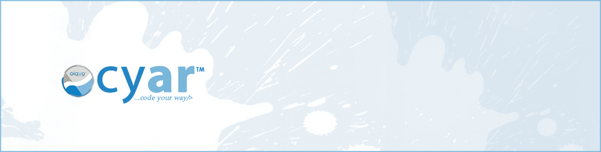

  

# CYAR™ Framework
> **Official Repository for CYAR™**  
> Welcome to the Official Repository for CYAR™!  
> The framework that respects your workflow, letting you structure and implement solutions on your terms.  

*"Your project, your workflow. So code your way" - <cite>[Deron Ellse](http://www.deronellse.com)</cite>*  

## Impression  
CYAR™ framework is an evolving library for developing modem responsive static or dynamic website, database driven web applications, APIs and other web services quickly and efficiently while maintaining a small footprint and respecting the developer’s workflow.  

##Table of Content  

- [Welcome to CYAR™ Framework](#cyar-framework)  
- [Impression](#impression)  
- [Introduction](#introduction)  
  - [What's the essence?](#whats-the-essence)  
    - [Designed to purpose](#designed-to-purpose)  
- [Characteristics](#characteristics)  
  - [Flexible](#cyar-is-flexible)  
  - [Easy to Build On](#easy-to-build-on)  
  - [Built for Everyone](#built-for-everyone)  
  - [Small Footprint](#small-footprint)  
  - [Developer’s Edge](#developers-edge)  
- [History](#history)  
- [Getting Started](#getting-started)  
  - [Requirements](#requirements)  
  - [Developer’s Prerequisite](#developers-prerequisite)  
- [Development](#development)  
  - [Developers](#developers)  
  - [Contribute](#contribute)  
- [Support](#support)  
  - [Documentation](#documentation)  
  - [Mailing List](#mailing-list)  
- [Version System](#version-system)  
  - [Patch Release](#patch-release)  
  - [Minor Release](#minor-release)  
  - [Major Release](#major-release)   
- [Licensing](#licensing)  
- [Quick FAQ](#quick-faq)  
- [Important Links](#important-links)  
- [Contact Information](#contact-information)  

## Introduction  
CYAR™ framework is an evolving platform for developing modem responsive static or dynamic website, full-featured web applications with database, APIs and other web services using PHP, MySQL, HTML, CSS, JS & derived technology.  

### What's the essence?  
Did you see the [characteristics](#characteristics) already? You should.  
Certainly there are many popular frameworks out there, but sometimes you don’t always need a kitchen-sink solution. Yes these frameworks are great but often very bloated and overkill for your project.  

#### Designed to purpose
CYAR™ framework is built for those who need an elegant platform which helps to quickly create simple yet powerful websites, full-featured web applications and APIs using native technology synonym with web development. 

##Characteristics  
I'll let you navigate where you wish to know more.  
[Flexible](#quik-is-flexible) | [Easy to build upon](#easy-to-build-on) | [Designed for Everyone](#built-for-everyone) | [Simple Installation](#simple-installation) | [Zero Learning Curve](#zero-learning-curve)  
[Tiny footprint](#small-footprint) | [Natively built with technology you know](#zero-learning-curve) | [Open source](#can-i-use-quik) | [MIT License](#licensing) & [Absolutely free](#can-i-use-quik)  
[Premium, Community & Free Support](#support) | [Documentation](#documentation) | [Feature request](#feature-request) | [Articles](#wiki) & [F.A.Q](#cyar-faq)  

###CYAR™ is Flexible  

CYAR™ provides very flexible set of codes that lets you do what you need and nothing else.  CYAR™ is awesome for rapid development and prototyping. It is easy to understand as you can learn all about it by just reading its source code!  

###Easy to Build On
CYAR™ framework is easy to build on.  
There’s a default sample website that comes with the setup. The configuration and core library are easily accessible and can be modified or extended to suit your need.  

###Built for Everyone  
CYAR™ makes front-end and back-end web development much faster and easier to maintain.  It is made for everyone (designers, developers and people in between) of all skill levels and projects of any scale.  

###Simple Installation  
> Getting Up & Running is simple  

You can get up and running with CYAR™ taking the following steps.  
- [ ] Download the zip archive  
- [ ] Extract contents to your project directory  
- [ ] Update entries in the configuration file as needed by your project, and  
- [ ] Start building your project.  

###Zero Learning Curve  
> ~~Nope!~~ I'm joking, but it could be.  

Rather than a restrictive coding pattern or language structure, CYAR™ lets you code in native technology such as HTML, CSS, PHP, MySQL, XML, Javascript, etc.; greatly diminishing the learning curve to between [3 – 0] on a descending scale of 9 to 0 where 0 is no learning curve at all.  

###Small Footprint
CYAR™ is a not bloated, relatively small footprint web framework for developers, designers and everyone in between that helps you quickly write simple yet powerful web applications and APIs  

###Developer’s Edge
With CYAR™, the developer can realize project objective efficiently and swiftly by focusing on building logic without impacting on accustomed or predefined workflow and development scheme.

## History  
History? Not much history really. CYAR™ framework started out as a library built by Deron Ellse to ease personal workflow in web development. The desire for growth, learning new possibilities and approach, following trends while maintaining standard and backward compatibility as much as possible has pushed the constant refining of this framework.  

In the light of open source came the decision to share. I suppose now the history can begin.  

##Getting Started  
####Requirements  
Other than your regular setup, i.e. a web server (Apache or any other HTTP Server), PHP installation and basic modules, optional database server (MySQL, MSSQL, etc.), CYAR™ framework has no special requirements.  

####Prerequisite for Developers  
As a developer you should already have your setup and know your technology for building web applications. Other than this knowledge, nothing is required. However, we can always learn our hand when you need us. 

## Version System  
CYAR™ framework operates a semantic version release system. You can read about [semantic version system](http://semver.org). We basically have major, minor and patch releases.  

### Patch Release  
> Bug fixes and minor fine-tunning  

Patch release are backwards-compatible bug fixes and minor enhancements within the same version number, i.e. 3.2.0, 3.2.1, 3.2.3 etc. You will noticed changes in the right part of the version number.  

###Minor Release  
> Added functionality that won't break your code  

Minor release contains added functionality in a backwards-compatible manner within the same version number. You will noticed changes in the center part of the version number, i.e. 3.2.0, 3.3.0, 3.4.0 etc.  

### Major Release
> Major updates that may break your old code  

Major release are major changes to the program and a change in the left part of the version number, i.e. 3.2.0, 4.3.0, 5.4.0 etc.  

**Please Note:**  
Although we strive to maintain backward compatibility on new version upgrades, it is important that *developers* ("web designers/developers") and users understand that improvement on the program is based on usage, modem requirements, efficiency, relevance and security; as such the direction of the framework will focus more on these factors over backward compatibility.  
We encourage *developers* to stay current and always download the latest version containing fixes and new modules or functionality when necessary, and advise *developers* to avoid overwrite on working editions without having backup.  

## LICENSE

Copyright 2016 [OIAVO](http://www.oiavo.com.ng)™

CYAR™ framework is released under the [MIT LICENSE](https://opensource.org/licenses/MIT) (the "License"). You will find a copy of this license attached.  
**In summary,** 

- You can use, copy and modify the software however you want.
- You can distribute the software with no restrictions.
- You are required to include the license agreement in your distribution and usage.
- You may provide attribution back to OIAVO™.
- You acknowledge that the OIAVO™ is not liable in any form

## CYAR™ Development  
### The Team behind CYAR™  
1. [Deron Ellse](http://about.me/deronellse) *(Creator & Lead Developer)*  

### Contribute  
Contributions are always welcome! Please read the [contribution guidelines](Guidelines.MD#contribution) to learn more.  

## Help and Support  
CYAR™ being an open source project, you can rely on community support.  However, at [OIAVO](http://www.oiavo.net)™ we provide excellent free/premium support and respond to issues as swiftly as possible.  You can visit our website at [www.oiavo.net](www.oiavo.net) or find our contact information below.  

### Documentation  
For official documentation and more information about CYAR™ framework visit our official web-page  

### Mailing List  
You can always subscribe or unsubscribe to our mailing list from our official URL to get notification on major upgrade or minor updates.  

## F.A.Q  
**Can I use CYAR™?**  
*Yes, it’s free and open source as such you can do whatever you love with it.*  

**Can anyone build projects on CYAR™?**  
*Yeah, just about anyone and everyone who is interested.*  

**What can CYAR™ build?**  
*All your web projects. (websites, applications, APIs & web services)*  

**What languages do I need to learn?**  
*To be able to build website natively you'll primarily need to learn HTML and CSS.  
You can include Javascript for client side interactiveness and if you want to build web applications then you'll need a server side scripting language (PHP)* 

**Do I need to know MySQL?**
*This depends on the type of project you want to build. Primarily to build a website you only need HTML and CSS.*

## Important Links
Join the [online community](http://community.oiavo.com.ng/cyar) for comments, discussion & community support.  
Report [Bugs & Issues](https://github.com/oiavo/cyar/issues) found on CYAR™ framework.  
You can request new features at [Feature Request](http://www.oiavo.com.ng).  
And yes we also created a [wiki section](https://github.com/oiavo/cyar/wiki)  

## Contact Information
**[OIAVO™](http://www.oiavo.com.ng)** - [**CYAR™ Framework**](https://oiavo.github.io/cyar)    
Github: @[oiavo](http://oiavo.github.io) | Twitter: @[oiavo](http://www.twitter.com/oiavo) | Facebook: [fb.com/oiavo](http://www.facebook.com/oiavo)  
[+234 (0) 805-542-7588](tel:+2348055427588) (Call, SMS & WhatsApp)  

“*Crafting a responsive website? we’d love to help!” – [cis@oiavo.com.ng](mailto:cis@oiavo.com.ng)*  